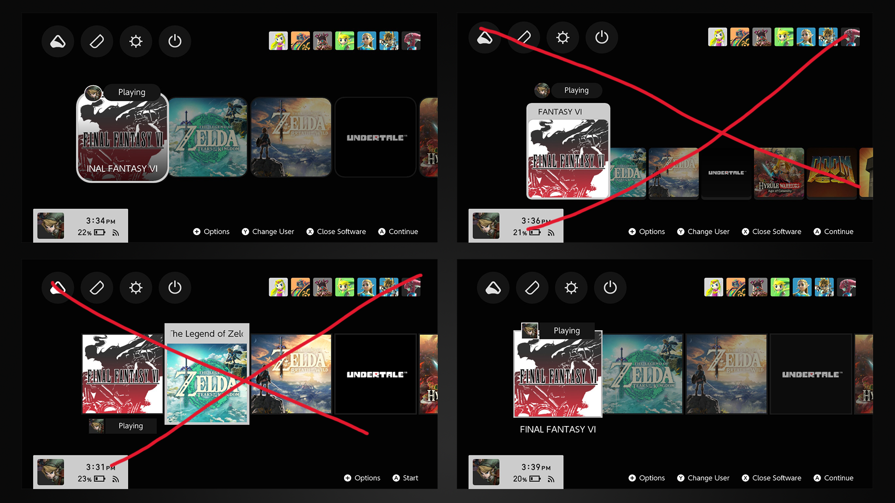

# MODDED B&W COLORWAY FOR SWITCH OLED MODEL
Theme injector WILL not work, use the Themezer online tool, make sure to use common.json unless you want a huge white bar across your profile icon

-----------------

# CHROMA, sleek themes for Nintendo Switch

CHROMA is an NXTheme project that aims to (hopefully) bring sleek designs to your Switch interface, providing a collection of themes that share similar UI design criteria. The intent here was to turn one year's worth of accumulated knowledge in Switch theming into full-fledged and coherent theme packs. While I don't consider the end result anywhere near perfect, great attention has still been given to color consistency and details.

As of now, it comes in **8 layout variants for the home screen** (more specifically the games row), and it's pre-bundled with a few color schemes.

Contributors are always welcome, so feel free to fork this repository if you want to implement additional color schemes. Excluding bug reports, I won't be taking any requests.

**Important: set your console to dark mode before using CHROMA** (System Settings > Themes > Basic Black)

## Features

**Layout variants (base layouts)**

- **Regular squared:** big squared icons. The focus animation when a game is highlighted is similar to what can be seen in SteamOS' Big Picture Mode.
- **Regular rounded:** same as right above but icons are rounded.

**Color schemes**

- **B&W** (base color scheme)

## Quick showcase

## Theme editing

This repository contains the themes' source code as well as their assets. Before anything else, [check out the documentation](https://layoutdocs.themezer.net/) to learn more about editing layouts. Additionally, a wiki that explicits the specifics of those themes *might* be published at some point.

Now, please note that CHROMA involves very intricate layouts as they massively rely on animations and convenient re-use of pre-existing UI elements (which is often the case with my NXTheme releases). You will most likely have a hard time to tweak those themes without breaking something. Also, most colors are dynamically handled (through animations) so making color changes isn't as straightforward as editing hex values within the JSON files. In fact, you will absolutely need Layout Editor for most of the UI.

**Credits would be greatly appreciated if you're planning to publicly share your edited theme.**

## Known issues

- In the sidebar layout, the games scrolling will behave weirdly if the sidebar is accessed through some particular ways. It doesn't affect the navigation that much and there's a chance you won't even notice. This issue actually arose in Unison R as well, and unfortunately I have no solution to prevent this behavior.

## Changelog

The versioning is independent for each applet. Sorry for the mess.

### Home screen

#### v1.1

- **Fixed Atmosphere crashing when uninstalling a game**
- **+2 layouts: default large icons, cards alt rounded**

### Settings

#### v1.1

- **New generalized layout**
  - styled "Manage Software" tab

### v1.0 - initial/shared release (all applets)

## Credits
[Original Theme](https://github.com/Kalyvara/NXTheme-CHROMA)
- Atmosphere icon in CHROMA Terra Edition by [dh park](https://thenounproject.com/icon/leaf-5958752/)
- Atmosphere icon in CHROMA Aqua Edition by [Viktor Vorobyev](https://thenounproject.com/icon/water-drop-504908/)
- Atmosphere icon in CHROMA Murasaki Edition by [Cuputo](https://thenounproject.com/icon/book-4146408/)
- Atmosphere icon in all other variants by u/Quat0rz
- Switch controller SVG in Neo Famicom's lockscreen by [Chad Remsing](https://thenounproject.com/icon/switch-charging-controller-930118/)
- Special thanks to [LayoutDocs](https://layoutdocs.themezer.net/) contributors
